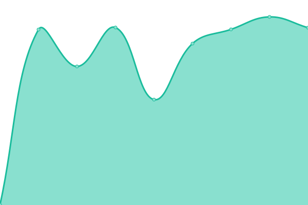

# [📈 Live Status](https://moon.status.absor.top): <!--live status--> **🟩 All systems operational**

This repository contains the open-source uptime monitor and status page for [Absortian](https://moon.status.absor.top), powered by [Upptime](https://github.com/upptime/upptime).

With [Upptime](https://upptime.js.org), you can get your own unlimited and free uptime monitor and status page, powered entirely by a GitHub repository. We use [Issues](https://github.com/Absortian/AbsorStatus/issues) as incident reports, [Actions](https://github.com/Absortian/AbsorStatus/actions) as uptime monitors, and [Pages](https://moon.status.absor.top) for the status page.

<!--start: status pages-->
<!-- This summary is generated by Upptime (https://github.com/upptime/upptime) -->
<!-- Do not edit this manually, your changes will be overwritten -->
<!-- prettier-ignore -->
| URL | Status | History | Response Time | Uptime |
| --- | ------ | ------- | ------------- | ------ |
|  [NoVayasDescalzo](https://novayasdescalzo.com/) | 🟩 Up | [no-vayas-descalzo.yml](https://github.com/absortian/MoonStatus/commits/HEAD/history/no-vayas-descalzo.yml) | 

 915ms
     
 | 

<a href="https://moon.status.absor.top/history/no-vayas-descalzo">100.00%</a>
    

|  [UrbanKingStore](https://urbankingstore.com/) | 🟩 Up | [urban-king-store.yml](https://github.com/absortian/MoonStatus/commits/HEAD/history/urban-king-store.yml) | 

 578ms
     
 | 

<a href="https://moon.status.absor.top/history/urban-king-store">100.00%</a>
    

|  [TheFootPlanet](https://thefootplanet.com/) | 🟩 Up | [the-foot-planet.yml](https://github.com/absortian/MoonStatus/commits/HEAD/history/the-foot-planet.yml) | 

 1054ms
     
 | 

<a href="https://moon.status.absor.top/history/the-foot-planet">65.32%</a>
    

<!--end: status pages-->

[**Visit our status website →**](https://moon.status.absor.top)

## 📄 License

- Powered by: [Upptime](https://github.com/upptime/upptime)
- Code: [MIT](./LICENSE) © [Absortian](https://moon.status.absor.top)
- Data in the `./history` directory: [Open Database License](https://opendatacommons.org/licenses/odbl/1-0/)
